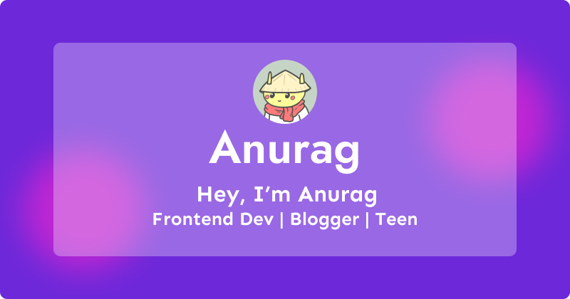

# Hey There👋, I'm [Anurag](https://bio.link/anuragkr)

#### I'm a 15 y/o Frontend Developer based in India! I also write blogs sometimes and I love listening to music!
     

     
- 🔭 I’m currently working on Backend Development  
- 🌱 I’m currently learning everything that i can 
- 📫 How to reach me: kr.anurag24@gmail.com and <a href="https://twitter.com/kr_anurag_">Twitter</a>  
- 😄 Pronouns: He/Him  
- ⚡ Fun fact: Music 🧠is what that drives me!!   
- 😇 I'm currently looking for help in Full Stack development  
- and, i write blogs on <a href='https://blog.anurag.tech'>hashnode</a>

## Skills 🚀

  

## Find me around the web 🌐

- [Twitter](https://twitter.com/kr_anurag_)
- [Github](https://github.com/kr-anurag)
- [Blog](https://blog.anurag.tech)

## Github Stats ⚡

## My Latest Articles ✍️

<!-- BLOG-POST-LIST:START -->
- [Basics of E2E Testing and Integrating Cypress with Next.js](https://blog.anurag.tech/basics-of-e2e-testing-and-integrating-cypress-with-nextjs)
- [How I structure my Next JS Projects](https://blog.anurag.tech/how-i-structure-my-next-js-projects)
- [💫 Introducing Vault3 - Your safest decentralized vault!](https://blog.anurag.tech/introducing-vault3)
- [Metamask authentication in NextJS with Third Web](https://blog.anurag.tech/metamask-authentication-in-nextjs-with-third-web)
- [Component Polymorphism in React](https://blog.anurag.tech/component-polymorphism-in-react)
<!-- BLOG-POST-LIST:END -->

## ⚡ My latest activity
<!--START_SECTION:activity-->
1. 🎉 Merged PR [#90](https://github.com/kr-anurag/portfolio/pull/90) in [kr-anurag/portfolio](https://github.com/kr-anurag/portfolio)
2. 💪 Opened PR [#90](https://github.com/kr-anurag/portfolio/pull/90) in [kr-anurag/portfolio](https://github.com/kr-anurag/portfolio)
3. 🎉 Merged PR [#89](https://github.com/kr-anurag/portfolio/pull/89) in [kr-anurag/portfolio](https://github.com/kr-anurag/portfolio)
4. 💪 Opened PR [#28](https://github.com/avneesh0612/thirdsnips/pull/28) in [avneesh0612/thirdsnips](https://github.com/avneesh0612/thirdsnips)
5. 💪 Opened PR [#26](https://github.com/avneesh0612/thirdsnips/pull/26) in [avneesh0612/thirdsnips](https://github.com/avneesh0612/thirdsnips)
<!--END_SECTION:activity-->

## My Projects  📁

## Discord Status 💻

